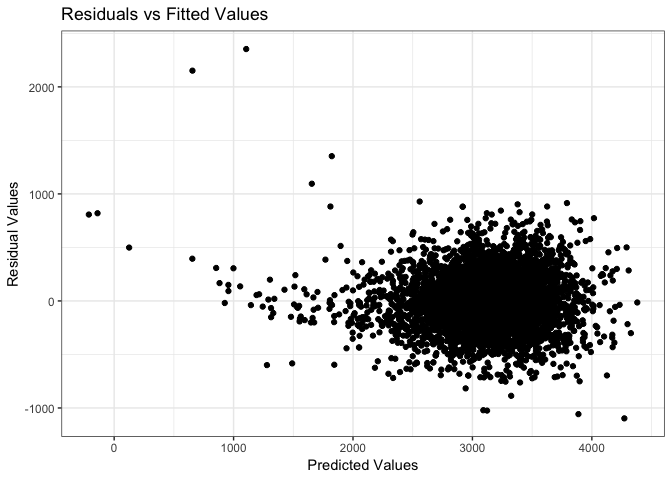
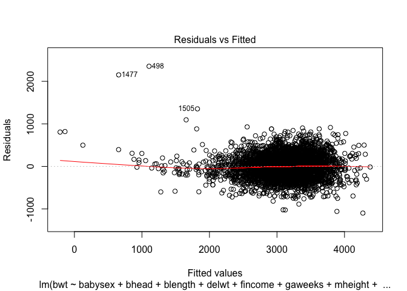
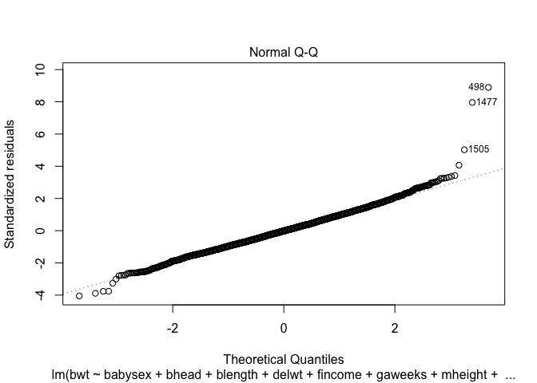
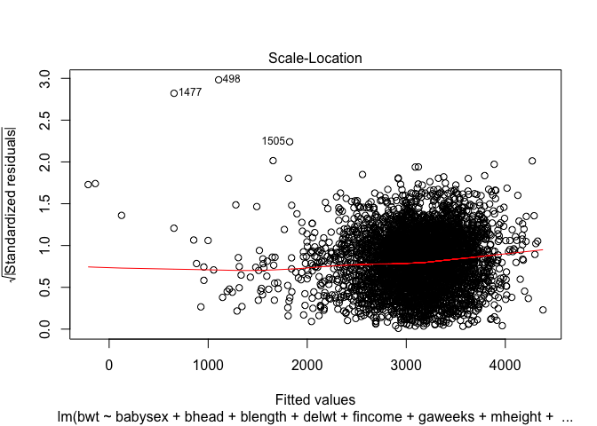
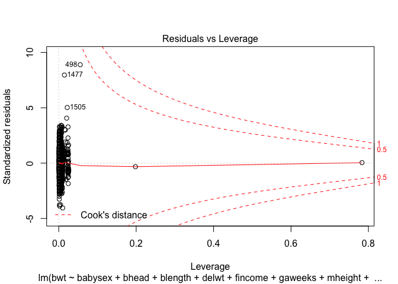
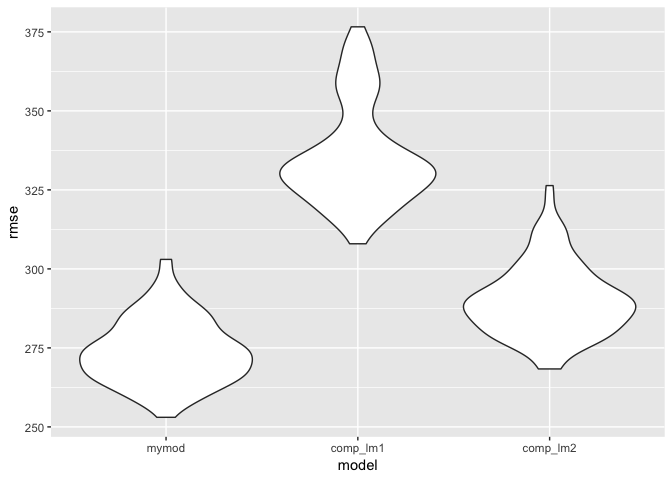

p8105\_hw6\_zdz2101
================
Zelos Zhu
11/26/2018

Load packages
=============

``` r
library(tidyverse)
library(purrr)
library(knitr)
library(broom)
library(ggthemes)
library(modelr)
library(mgcv)
```

Problem 1
=========

``` r
homicide_df <- read_csv("https://raw.githubusercontent.com/washingtonpost/data-homicides/master/homicide-data.csv")
```

    ## Parsed with column specification:
    ## cols(
    ##   uid = col_character(),
    ##   reported_date = col_integer(),
    ##   victim_last = col_character(),
    ##   victim_first = col_character(),
    ##   victim_race = col_character(),
    ##   victim_age = col_character(),
    ##   victim_sex = col_character(),
    ##   city = col_character(),
    ##   state = col_character(),
    ##   lat = col_double(),
    ##   lon = col_double(),
    ##   disposition = col_character()
    ## )

``` r
homicide_df <- homicide_df %>%
  mutate(city_state = str_c(city, ", ", state),
         homicide_status = ifelse(disposition == "Closed by arrest", 1, 0),
         victim_age = as.numeric(victim_age),
         victim_race_recoded = as.factor(ifelse(victim_race == "White", "white", "non-white")),
         victim_race_recoded = relevel(victim_race_recoded, "white")) %>%
  filter(!city_state %in% c("Tulsa, AL", "Dallas, TX", "Phoenix, AZ", "Kansas City, MO"))
```

    ## Warning in evalq(as.numeric(victim_age), <environment>): NAs introduced by
    ## coercion

``` r
#Logistic model for Baltimore
homicide_df %>%
  filter(city_state == "Baltimore, MD") %>%
  glm(homicide_status ~ victim_age + victim_sex + victim_race_recoded, family = binomial(), data = .) %>%
  tidy() %>%
  filter(term == "victim_race_recodednon-white") %>%
  mutate(estimate_exp = exp(estimate),
         lower_bound_CI = exp(estimate - 1.96*std.error),
         upper_bound_CI = exp(estimate + 1.96*std.error)) %>%
  select(estimate_exp, lower_bound_CI, upper_bound_CI)
```

    ## # A tibble: 1 x 3
    ##   estimate_exp lower_bound_CI upper_bound_CI
    ##          <dbl>          <dbl>          <dbl>
    ## 1        0.441          0.313          0.620

``` r
#doing it for all cities
cities_odds <- homicide_df %>% 
  group_by(city_state) %>% 
  nest() %>% 
  mutate(models = map(data, ~glm(homicide_status ~ victim_age + victim_sex + victim_race_recoded, family = binomial(), data = .x)),
         models = map(models, broom::tidy)) %>%
  select(-data) %>%
  unnest() %>%
  filter(term == "victim_race_recodednon-white") %>%
  mutate(estimate_exp = exp(estimate),
         lower_bound_CI = exp(estimate - 1.96*std.error),
         upper_bound_CI = exp(estimate + 1.96*std.error)) %>%
  select(city_state, estimate_exp, lower_bound_CI, upper_bound_CI)

kable(cities_odds)
```

| city\_state        |  estimate\_exp|  lower\_bound\_CI|  upper\_bound\_CI|
|:-------------------|--------------:|-----------------:|-----------------:|
| Albuquerque, NM    |      0.7414698|         0.4512868|         1.2182443|
| Atlanta, GA        |      0.7528020|         0.4315063|         1.3133316|
| Baltimore, MD      |      0.4406080|         0.3129079|         0.6204234|
| Baton Rouge, LA    |      0.6676289|         0.3127439|         1.4252185|
| Birmingham, AL     |      1.0392783|         0.6150483|         1.7561211|
| Boston, MA         |      0.1145531|         0.0471531|         0.2782939|
| Buffalo, NY        |      0.3898879|         0.2127526|         0.7145036|
| Charlotte, NC      |      0.5575017|         0.3207914|         0.9688794|
| Chicago, IL        |      0.5620844|         0.4311321|         0.7328123|
| Cincinnati, OH     |      0.3183560|         0.1839996|         0.5508195|
| Columbus, OH       |      0.8547029|         0.6339868|         1.1522590|
| Denver, CO         |      0.6018870|         0.3589787|         1.0091626|
| Detroit, MI        |      0.6512456|         0.4877782|         0.8694953|
| Durham, NC         |      1.0028175|         0.4041085|         2.4885469|
| Fort Worth, TX     |      0.8378356|         0.5545077|         1.2659311|
| Fresno, CA         |      0.4478015|         0.2306060|         0.8695617|
| Houston, TX        |      0.8726047|         0.6986847|         1.0898176|
| Indianapolis, IN   |      0.5045560|         0.3817941|         0.6667909|
| Jacksonville, FL   |      0.6581751|         0.5023197|         0.8623880|
| Las Vegas, NV      |      0.7554159|         0.5864306|         0.9730958|
| Long Beach, CA     |      0.7939031|         0.3876546|         1.6258857|
| Los Angeles, CA    |      0.6658424|         0.4828459|         0.9181936|
| Louisville, KY     |      0.3919136|         0.2589809|         0.5930794|
| Memphis, TN        |      0.7823191|         0.5238191|         1.1683866|
| Miami, FL          |      0.5762370|         0.3772438|         0.8801975|
| Milwaukee, wI      |      0.6323892|         0.4033912|         0.9913854|
| Minneapolis, MN    |      0.6457029|         0.3447349|         1.2094287|
| Nashville, TN      |      0.8985913|         0.6533730|         1.2358427|
| New Orleans, LA    |      0.4659337|         0.2947205|         0.7366105|
| New York, NY       |      0.5314592|         0.2793572|         1.0110671|
| Oakland, CA        |      0.2129779|         0.1043603|         0.4346441|
| Oklahoma City, OK  |      0.6812533|         0.4780242|         0.9708841|
| Omaha, NE          |      0.1689228|         0.0935132|         0.3051432|
| Philadelphia, PA   |      0.6438263|         0.4862491|         0.8524692|
| Pittsburgh, PA     |      0.2815606|         0.1607457|         0.4931788|
| Richmond, VA       |      0.4474146|         0.1616764|         1.2381512|
| San Antonio, TX    |      0.6893496|         0.4613199|         1.0300939|
| Sacramento, CA     |      0.7807364|         0.4486304|         1.3586894|
| Savannah, GA       |      0.5964045|         0.2800315|         1.2702083|
| San Bernardino, CA |      0.8801457|         0.3928312|         1.9719832|
| San Diego, CA      |      0.4833560|         0.2976277|         0.7849839|
| San Francisco, CA  |      0.4582812|         0.2904504|         0.7230896|
| St. Louis, MO      |      0.5770478|         0.4059333|         0.8202928|
| Stockton, CA       |      0.3757201|         0.1964244|         0.7186762|
| Tampa, FL          |      1.1588262|         0.5870394|         2.2875435|
| Tulsa, OK          |      0.6024687|         0.4130931|         0.8786605|
| Washington, DC     |      0.5100815|         0.2577041|         1.0096200|

``` r
cities_odds %>%
  ungroup( )%>%
  arrange(estimate_exp) %>%
  mutate(city_state = factor(city_state, levels = city_state)) %>%
  ggplot(aes(x = city_state, y = estimate_exp)) + 
  geom_point() + 
  geom_errorbar(aes(x = city_state, ymin = lower_bound_CI, ymax = upper_bound_CI), width=0.2, size=1, color="blue") + 
  coord_flip() + 
  geom_hline(yintercept = 1) +
  ylab("Odds Ratio of Solved Homcides") + 
  xlab("City, State") + 
  ggtitle("Comparing Solved Homicides of Whites(ref) vs Non-whites") +
  theme_few()
```


Just from an initial look at the plot, it seems that nonwhites generally have lower adds at having solved homicide cases; this is true for a large majority of American cities. Only 3 cities have odds higher than 1, meaning non whites have higher odds, those cities being Durham, NC, Birmingham, AL, and Tampa, FL. I added a reference line at 1 to indicate whether or not the confidence interval contains 1, the findings are insignificant(at alpha = 0.05 level) and it seems about half, maybe a little less do seem to overlap.

Interestingly Boston is ranked all the way at the bottom here having the lowest odds and one of the narrowest CI bands. I would say this is a sign/indication there might be some discrimination going on that could warrant further investigation. I mention Boston because as a huge baseball fan I remember two scandals that happened at Fenway park just last year: a racial slur being called out to a player on the field and a big banner that was unrolled onto the wall of the stadium that said "Racism is as American as Baseball". Findings like this do not reflect well on a city that may already have a questionable history with racism.

Problem 2
=========

``` r
birthweight_df <- read_csv("birthweight.csv")
```

    ## Parsed with column specification:
    ## cols(
    ##   .default = col_integer(),
    ##   gaweeks = col_double(),
    ##   ppbmi = col_double(),
    ##   smoken = col_double()
    ## )

    ## See spec(...) for full column specifications.

``` r
colSums(is.na(birthweight_df)) ##-- missing data is not an issue
```

    ##  babysex    bhead  blength      bwt    delwt  fincome    frace  gaweeks 
    ##        0        0        0        0        0        0        0        0 
    ##  malform menarche  mheight   momage    mrace   parity  pnumlbw  pnumsga 
    ##        0        0        0        0        0        0        0        0 
    ##    ppbmi     ppwt   smoken   wtgain 
    ##        0        0        0        0

``` r
#check for NAs
apply(birthweight_df[,-c(7,13)], 2, summary)
```

    ##          babysex    bhead  blength      bwt    delwt  fincome  gaweeks
    ## Min.    1.000000 21.00000 20.00000  595.000  86.0000  0.00000 17.70000
    ## 1st Qu. 1.000000 33.00000 48.00000 2807.000 131.0000 25.00000 38.30000
    ## Median  1.000000 34.00000 50.00000 3132.500 143.0000 35.00000 39.90000
    ## Mean    1.486412 33.65085 49.75058 3114.404 145.5721 44.10525 39.42626
    ## 3rd Qu. 2.000000 35.00000 51.00000 3459.000 157.0000 65.00000 41.10000
    ## Max.    2.000000 41.00000 63.00000 4791.000 334.0000 96.00000 51.30000
    ##             malform menarche  mheight   momage      parity pnumlbw pnumsga
    ## Min.    0.000000000  0.00000 48.00000 12.00000 0.000000000       0       0
    ## 1st Qu. 0.000000000 12.00000 62.00000 18.00000 0.000000000       0       0
    ## Median  0.000000000 12.00000 63.00000 20.00000 0.000000000       0       0
    ## Mean    0.003454629 12.51428 63.49309 20.29917 0.002303086       0       0
    ## 3rd Qu. 0.000000000 13.00000 65.00000 22.00000 0.000000000       0       0
    ## Max.    1.000000000 19.00000 77.00000 44.00000 6.000000000       0       0
    ##            ppbmi     ppwt    smoken    wtgain
    ## Min.    13.07137  70.0000  0.000000 -46.00000
    ## 1st Qu. 19.52637 110.0000  0.000000  15.00000
    ## Median  21.02642 120.0000  0.000000  22.00000
    ## Mean    21.57037 123.4906  4.145181  22.08153
    ## 3rd Qu. 22.91060 134.0000  5.000000  28.00000
    ## Max.    46.09639 287.0000 60.000000  89.00000

So missing data isn't an issue but it seems pnumlbw and pnumgsa provide no helpful information because the columns are just filled with zeroes. We need to convert the race variable into factor and remove these meaningless columns out of our dataset.

``` r
#clean certain variables -- everything is truly numeric/integer except race variables
birthweight_df <- birthweight_df %>%
  mutate(frace = factor(frace),
         mrace = factor(mrace)) %>%
  select(-c("pnumlbw", "pnumsga"))


all_variable_fit <- lm(bwt ~ ., data = birthweight_df)
a <- step(all_variable_fit, direction = "backward")
```

    ## Start:  AIC=48717.83
    ## bwt ~ babysex + bhead + blength + delwt + fincome + frace + gaweeks + 
    ##     malform + menarche + mheight + momage + mrace + parity + 
    ##     ppbmi + ppwt + smoken + wtgain
    ## 
    ## 
    ## Step:  AIC=48717.83
    ## bwt ~ babysex + bhead + blength + delwt + fincome + frace + gaweeks + 
    ##     malform + menarche + mheight + momage + mrace + parity + 
    ##     ppbmi + ppwt + smoken
    ## 
    ##            Df Sum of Sq       RSS   AIC
    ## - frace     4    124365 320848704 48712
    ## - malform   1      1419 320725757 48716
    ## - ppbmi     1      6346 320730684 48716
    ## - momage    1     28661 320752999 48716
    ## - mheight   1     66886 320791224 48717
    ## - menarche  1    111679 320836018 48717
    ## - ppwt      1    131132 320855470 48718
    ## <none>                  320724338 48718
    ## - fincome   1    193454 320917792 48718
    ## - parity    1    413584 321137922 48721
    ## - mrace     3    868321 321592659 48724
    ## - babysex   1    853796 321578134 48727
    ## - gaweeks   1   4611823 325336161 48778
    ## - smoken    1   5076393 325800732 48784
    ## - delwt     1   8008891 328733230 48823
    ## - blength   1 102050296 422774634 49915
    ## - bhead     1 106535716 427260054 49961
    ## 
    ## Step:  AIC=48711.51
    ## bwt ~ babysex + bhead + blength + delwt + fincome + gaweeks + 
    ##     malform + menarche + mheight + momage + mrace + parity + 
    ##     ppbmi + ppwt + smoken
    ## 
    ##            Df Sum of Sq       RSS   AIC
    ## - malform   1      1447 320850151 48710
    ## - ppbmi     1      6975 320855679 48710
    ## - momage    1     28379 320877083 48710
    ## - mheight   1     69502 320918206 48710
    ## - menarche  1    115708 320964411 48711
    ## - ppwt      1    133961 320982665 48711
    ## <none>                  320848704 48712
    ## - fincome   1    194405 321043108 48712
    ## - parity    1    414687 321263390 48715
    ## - babysex   1    852133 321700837 48721
    ## - gaweeks   1   4625208 325473911 48772
    ## - smoken    1   5036389 325885093 48777
    ## - delwt     1   8013099 328861802 48817
    ## - mrace     3  13540415 334389119 48885
    ## - blength   1 101995688 422844392 49908
    ## - bhead     1 106662962 427511666 49956
    ## 
    ## Step:  AIC=48709.53
    ## bwt ~ babysex + bhead + blength + delwt + fincome + gaweeks + 
    ##     menarche + mheight + momage + mrace + parity + ppbmi + ppwt + 
    ##     smoken
    ## 
    ##            Df Sum of Sq       RSS   AIC
    ## - ppbmi     1      6928 320857079 48708
    ## - momage    1     28660 320878811 48708
    ## - mheight   1     69320 320919470 48708
    ## - menarche  1    116027 320966177 48709
    ## - ppwt      1    133894 320984044 48709
    ## <none>                  320850151 48710
    ## - fincome   1    193784 321043934 48710
    ## - parity    1    414482 321264633 48713
    ## - babysex   1    851279 321701430 48719
    ## - gaweeks   1   4624003 325474154 48770
    ## - smoken    1   5035195 325885346 48775
    ## - delwt     1   8029079 328879230 48815
    ## - mrace     3  13553320 334403471 48883
    ## - blength   1 102009225 422859375 49906
    ## - bhead     1 106675331 427525481 49954
    ## 
    ## Step:  AIC=48707.63
    ## bwt ~ babysex + bhead + blength + delwt + fincome + gaweeks + 
    ##     menarche + mheight + momage + mrace + parity + ppwt + smoken
    ## 
    ##            Df Sum of Sq       RSS   AIC
    ## - momage    1     29211 320886290 48706
    ## - menarche  1    117635 320974714 48707
    ## <none>                  320857079 48708
    ## - fincome   1    195199 321052278 48708
    ## - parity    1    412984 321270064 48711
    ## - babysex   1    850020 321707099 48717
    ## - mheight   1   1078673 321935752 48720
    ## - ppwt      1   2934023 323791103 48745
    ## - gaweeks   1   4621504 325478583 48768
    ## - smoken    1   5039368 325896447 48773
    ## - delwt     1   8024939 328882018 48813
    ## - mrace     3  13551444 334408523 48881
    ## - blength   1 102018559 422875638 49904
    ## - bhead     1 106821342 427678421 49953
    ## 
    ## Step:  AIC=48706.02
    ## bwt ~ babysex + bhead + blength + delwt + fincome + gaweeks + 
    ##     menarche + mheight + mrace + parity + ppwt + smoken
    ## 
    ##            Df Sum of Sq       RSS   AIC
    ## - menarche  1    100121 320986412 48705
    ## <none>                  320886290 48706
    ## - fincome   1    240800 321127090 48707
    ## - parity    1    431433 321317724 48710
    ## - babysex   1    841278 321727568 48715
    ## - mheight   1   1076739 321963029 48719
    ## - ppwt      1   2913653 323799943 48743
    ## - gaweeks   1   4676469 325562760 48767
    ## - smoken    1   5045104 325931394 48772
    ## - delwt     1   8000672 328886962 48811
    ## - mrace     3  14667730 335554021 48894
    ## - blength   1 101990556 422876847 49902
    ## - bhead     1 106864308 427750598 49952
    ## 
    ## Step:  AIC=48705.38
    ## bwt ~ babysex + bhead + blength + delwt + fincome + gaweeks + 
    ##     mheight + mrace + parity + ppwt + smoken
    ## 
    ##           Df Sum of Sq       RSS   AIC
    ## <none>                 320986412 48705
    ## - fincome  1    245637 321232048 48707
    ## - parity   1    422770 321409181 48709
    ## - babysex  1    846134 321832545 48715
    ## - mheight  1   1012240 321998651 48717
    ## - ppwt     1   2907049 323893461 48743
    ## - gaweeks  1   4662501 325648912 48766
    ## - smoken   1   5073849 326060260 48771
    ## - delwt    1   8137459 329123871 48812
    ## - mrace    3  14683609 335670021 48894
    ## - blength  1 102191779 423178191 49903
    ## - bhead    1 106779754 427766166 49950

``` r
suggested_model <- lm(bwt ~ babysex + bhead + blength + delwt + fincome + gaweeks + mheight + mrace + parity + ppwt + smoken, data = birthweight_df)
summary(suggested_model)
```

    ## 
    ## Call:
    ## lm(formula = bwt ~ babysex + bhead + blength + delwt + fincome + 
    ##     gaweeks + mheight + mrace + parity + ppwt + smoken, data = birthweight_df)
    ## 
    ## Residuals:
    ##      Min       1Q   Median       3Q      Max 
    ## -1097.18  -185.52    -3.39   174.14  2353.44 
    ## 
    ## Coefficients:
    ##               Estimate Std. Error t value Pr(>|t|)    
    ## (Intercept) -6127.3799   138.6980 -44.178  < 2e-16 ***
    ## babysex        28.5580     8.4549   3.378 0.000737 ***
    ## bhead         130.7770     3.4466  37.944  < 2e-16 ***
    ## blength        74.9471     2.0190  37.120  < 2e-16 ***
    ## delwt           4.1067     0.3921  10.475  < 2e-16 ***
    ## fincome         0.3180     0.1747   1.820 0.068844 .  
    ## gaweeks        11.5925     1.4621   7.929 2.79e-15 ***
    ## mheight         6.5940     1.7849   3.694 0.000223 ***
    ## mrace2       -138.7925     9.9071 -14.009  < 2e-16 ***
    ## mrace3        -74.8868    42.3146  -1.770 0.076837 .  
    ## mrace4       -100.6781    19.3247  -5.210 1.98e-07 ***
    ## parity         96.3047    40.3362   2.388 0.017004 *  
    ## ppwt           -2.6756     0.4274  -6.261 4.20e-10 ***
    ## smoken         -4.8434     0.5856  -8.271  < 2e-16 ***
    ## ---
    ## Signif. codes:  0 '***' 0.001 '**' 0.01 '*' 0.05 '.' 0.1 ' ' 1
    ## 
    ## Residual standard error: 272.3 on 4328 degrees of freedom
    ## Multiple R-squared:  0.7181, Adjusted R-squared:  0.7173 
    ## F-statistic: 848.1 on 13 and 4328 DF,  p-value: < 2.2e-16

``` r
birthweight_df <- birthweight_df %>% 
  add_predictions(suggested_model) %>%
  add_residuals(suggested_model)

birthweight_df %>%
  ggplot(., aes(x = pred, y = resid)) +
  geom_point() + 
  theme_bw() +
  xlab("Predicted Values") + 
  ylab("Residual Values") + 
  ggtitle("Residuals vs Fitted Values")
```



``` r
plot(suggested_model) #model diagnostics look good
```



``` r
cv_df <- crossv_mc(birthweight_df, 100) %>%
  mutate(train = map(train, as_tibble),
         test  = map(test, as_tibble),
         my_mod     = map(train, ~lm(bwt ~ babysex + bhead + blength + delwt +
                                           fincome + gaweeks + mheight + mrace + 
                                           parity + ppwt + smoken, data = .x)),
         comp_lm1 = map(train, ~lm(bwt ~ blength + gaweeks, data = .x)),
         comp_lm2 = map(train, ~lm(bwt ~ bhead + blength + babysex +
                                         bhead*blength + bhead*babysex +
                                         blength*babysex + bhead*blength*babysex, data = .x)),
         rmse_mymod    = map2_dbl(my_mod, test, ~rmse(model = .x, data = .y)),
         rmse_comp_lm1 = map2_dbl(comp_lm1, test, ~rmse(model = .x, data = .y)),
         rmse_comp_lm2 = map2_dbl(comp_lm2, test, ~rmse(model = .x, data = .y)))
```

    ## Warning in predict.lm(model, data): prediction from a rank-deficient fit
    ## may be misleading

``` r
cv_df %>%
  select(starts_with("rmse")) %>% 
  gather(key = model, value = rmse) %>% 
  mutate(model = str_replace(model, "rmse_", ""),
         model = fct_inorder(model)) %>% 
  ggplot(aes(x = model, y = rmse)) + geom_violin()
```

 I chose to use an "automatic" process, using step-wise regression with backward elimation based on AIC. We just learned how to do this in Biostats Methods 1 over the past week or so. The end product was a model using 11 variables for prediction: babysex, bhead, blength, delwt, fincome, gaweeks,mheight, mrace, parity, ppwt, and smoken.

The hope for a residuals vs fitted values plot is to look random for all values centered around a 0 residual. I would say this is the case for **most** of the data. There does seem to be some weirdness for the plot for anything &lt;2000 on the predicted value; our model is quite off and seems to really overestimate for what turns out to be smaller babies.

Otherwise, the rest of our model diagnostics look decent, the extreme tail ends of the QQ plot don't quite align well but that is somewhat to be expected (model doesn't do well in extremes). And there are no extremely worrysome leverage/outlier points.

I recreated the rmse violin plot done in class with my model and the two proposed models. I would say based on rmse, my model from the stepwise regression generally performs the best but in terms of interpretation the second model with all the interaction effects is easiest to explain. The two predictor model is clearly the poorest. I fear my model may have been an overfit.
