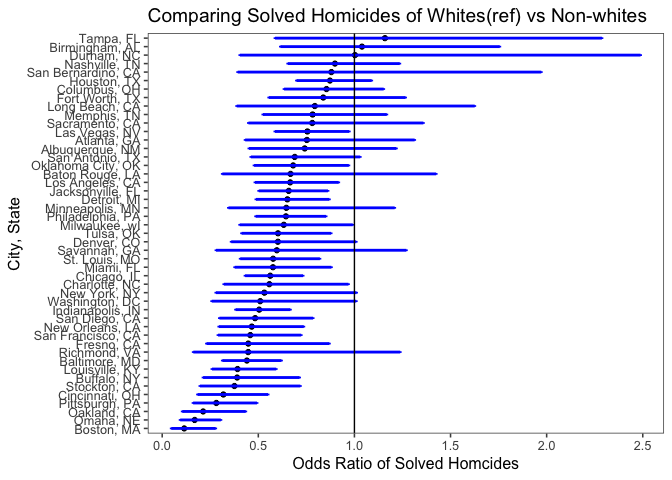

p8105\_hw6\_zdz2101
================
Zelos Zhu
11/26/2018

Load packages
=============

``` r
library(tidyverse)
library(purrr)
library(knitr)
library(broom)
library(ggthemes)
```

Problem 1
=========

``` r
homicide_df <- read_csv("https://raw.githubusercontent.com/washingtonpost/data-homicides/master/homicide-data.csv")
```

    ## Parsed with column specification:
    ## cols(
    ##   uid = col_character(),
    ##   reported_date = col_integer(),
    ##   victim_last = col_character(),
    ##   victim_first = col_character(),
    ##   victim_race = col_character(),
    ##   victim_age = col_character(),
    ##   victim_sex = col_character(),
    ##   city = col_character(),
    ##   state = col_character(),
    ##   lat = col_double(),
    ##   lon = col_double(),
    ##   disposition = col_character()
    ## )

``` r
homicide_df <- homicide_df %>%
  mutate(city_state = str_c(city, ", ", state),
         homicide_status = ifelse(disposition == "Closed by arrest", 1, 0),
         victim_age = as.numeric(victim_age),
         victim_race_recoded = as.factor(ifelse(victim_race == "White", "white", "non-white")),
         victim_race_recoded = relevel(victim_race_recoded, "white")) %>%
  filter(!city_state %in% c("Tulsa, AL", "Dallas, TX", "Phoenix, AZ", "Kansas City, MO"))
```

    ## Warning in evalq(as.numeric(victim_age), <environment>): NAs introduced by
    ## coercion

``` r
#Logistic model for Baltimore
homicide_df %>%
  filter(city_state == "Baltimore, MD") %>%
  glm(homicide_status ~ victim_age + victim_sex + victim_race_recoded, family = binomial(), data = .) %>%
  tidy() %>%
  filter(term == "victim_race_recodednon-white") %>%
  mutate(estimate_exp = exp(estimate),
         lower_bound_CI = exp(estimate - 1.96*std.error),
         upper_bound_CI = exp(estimate + 1.96*std.error)) %>%
  select(estimate_exp, lower_bound_CI, upper_bound_CI)
```

    ## # A tibble: 1 x 3
    ##   estimate_exp lower_bound_CI upper_bound_CI
    ##          <dbl>          <dbl>          <dbl>
    ## 1        0.441          0.313          0.620

``` r
#doing it for all cities
cities_odds <- homicide_df %>% 
  group_by(city_state) %>% 
  nest() %>% 
  mutate(models = map(data, ~glm(homicide_status ~ victim_age + victim_sex + victim_race_recoded, family = binomial(), data = .x)),
         models = map(models, broom::tidy)) %>%
  select(-data) %>%
  unnest() %>%
  filter(term == "victim_race_recodednon-white") %>%
  mutate(estimate_exp = exp(estimate),
         lower_bound_CI = exp(estimate - 1.96*std.error),
         upper_bound_CI = exp(estimate + 1.96*std.error)) %>%
  select(city_state, estimate_exp, lower_bound_CI, upper_bound_CI)

kable(cities_odds)
```

| city\_state        |  estimate\_exp|  lower\_bound\_CI|  upper\_bound\_CI|
|:-------------------|--------------:|-----------------:|-----------------:|
| Albuquerque, NM    |      0.7414698|         0.4512868|         1.2182443|
| Atlanta, GA        |      0.7528020|         0.4315063|         1.3133316|
| Baltimore, MD      |      0.4406080|         0.3129079|         0.6204234|
| Baton Rouge, LA    |      0.6676289|         0.3127439|         1.4252185|
| Birmingham, AL     |      1.0392783|         0.6150483|         1.7561211|
| Boston, MA         |      0.1145531|         0.0471531|         0.2782939|
| Buffalo, NY        |      0.3898879|         0.2127526|         0.7145036|
| Charlotte, NC      |      0.5575017|         0.3207914|         0.9688794|
| Chicago, IL        |      0.5620844|         0.4311321|         0.7328123|
| Cincinnati, OH     |      0.3183560|         0.1839996|         0.5508195|
| Columbus, OH       |      0.8547029|         0.6339868|         1.1522590|
| Denver, CO         |      0.6018870|         0.3589787|         1.0091626|
| Detroit, MI        |      0.6512456|         0.4877782|         0.8694953|
| Durham, NC         |      1.0028175|         0.4041085|         2.4885469|
| Fort Worth, TX     |      0.8378356|         0.5545077|         1.2659311|
| Fresno, CA         |      0.4478015|         0.2306060|         0.8695617|
| Houston, TX        |      0.8726047|         0.6986847|         1.0898176|
| Indianapolis, IN   |      0.5045560|         0.3817941|         0.6667909|
| Jacksonville, FL   |      0.6581751|         0.5023197|         0.8623880|
| Las Vegas, NV      |      0.7554159|         0.5864306|         0.9730958|
| Long Beach, CA     |      0.7939031|         0.3876546|         1.6258857|
| Los Angeles, CA    |      0.6658424|         0.4828459|         0.9181936|
| Louisville, KY     |      0.3919136|         0.2589809|         0.5930794|
| Memphis, TN        |      0.7823191|         0.5238191|         1.1683866|
| Miami, FL          |      0.5762370|         0.3772438|         0.8801975|
| Milwaukee, wI      |      0.6323892|         0.4033912|         0.9913854|
| Minneapolis, MN    |      0.6457029|         0.3447349|         1.2094287|
| Nashville, TN      |      0.8985913|         0.6533730|         1.2358427|
| New Orleans, LA    |      0.4659337|         0.2947205|         0.7366105|
| New York, NY       |      0.5314592|         0.2793572|         1.0110671|
| Oakland, CA        |      0.2129779|         0.1043603|         0.4346441|
| Oklahoma City, OK  |      0.6812533|         0.4780242|         0.9708841|
| Omaha, NE          |      0.1689228|         0.0935132|         0.3051432|
| Philadelphia, PA   |      0.6438263|         0.4862491|         0.8524692|
| Pittsburgh, PA     |      0.2815606|         0.1607457|         0.4931788|
| Richmond, VA       |      0.4474146|         0.1616764|         1.2381512|
| San Antonio, TX    |      0.6893496|         0.4613199|         1.0300939|
| Sacramento, CA     |      0.7807364|         0.4486304|         1.3586894|
| Savannah, GA       |      0.5964045|         0.2800315|         1.2702083|
| San Bernardino, CA |      0.8801457|         0.3928312|         1.9719832|
| San Diego, CA      |      0.4833560|         0.2976277|         0.7849839|
| San Francisco, CA  |      0.4582812|         0.2904504|         0.7230896|
| St. Louis, MO      |      0.5770478|         0.4059333|         0.8202928|
| Stockton, CA       |      0.3757201|         0.1964244|         0.7186762|
| Tampa, FL          |      1.1588262|         0.5870394|         2.2875435|
| Tulsa, OK          |      0.6024687|         0.4130931|         0.8786605|
| Washington, DC     |      0.5100815|         0.2577041|         1.0096200|

``` r
cities_odds %>%
  ungroup( )%>%
  arrange(estimate_exp) %>%
  mutate(city_state = factor(city_state, levels = city_state)) %>%
  ggplot(aes(x = city_state, y = estimate_exp)) + 
  geom_point() + 
  geom_errorbar(aes(x = city_state, ymin = lower_bound_CI, ymax = upper_bound_CI), width=0.2, size=1, color="blue") + 
  coord_flip() + 
  geom_hline(yintercept = 1) +
  ylab("Odds Ratio of Solved Homcides") + 
  xlab("City, State") + 
  ggtitle("Comparing Solved Homicides of Whites vs Non-whites") +
  theme_few()
```



Problem 2
=========
